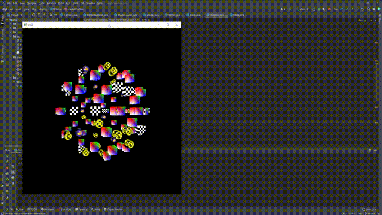

# Dtgl

A 3D java engine.

## What does handle

1. window creation offering opengl context,
2. for can generates only textured cubes or just colored,
3. shaders support,
4. Matrices and vectors maths,

## Based on which libs

1. LWJGL(Lightweight Java Game Library)
2. GLFW for handeling window events

## Screneshots

